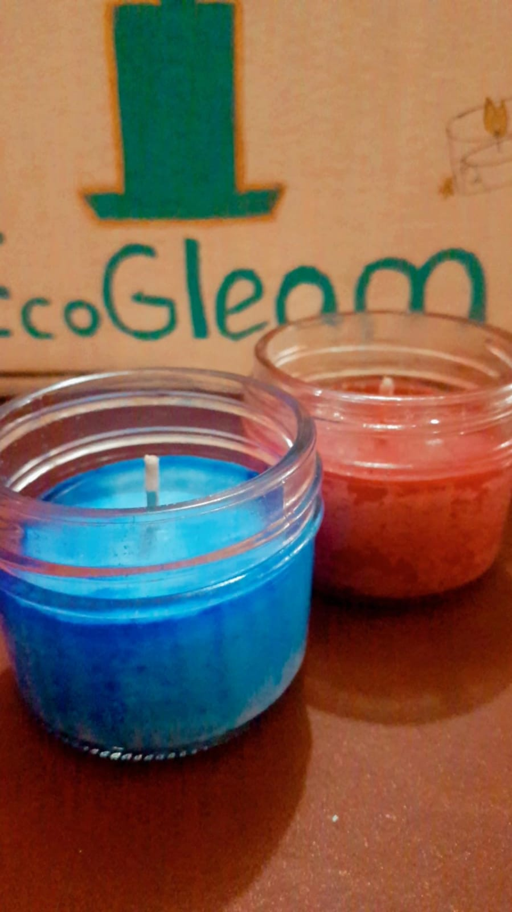
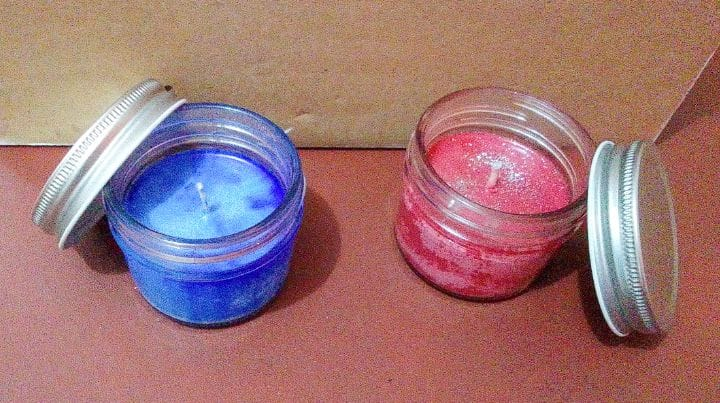
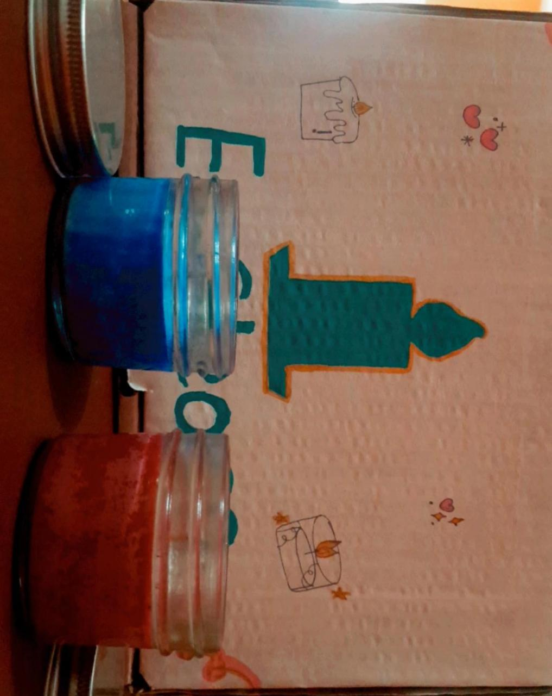
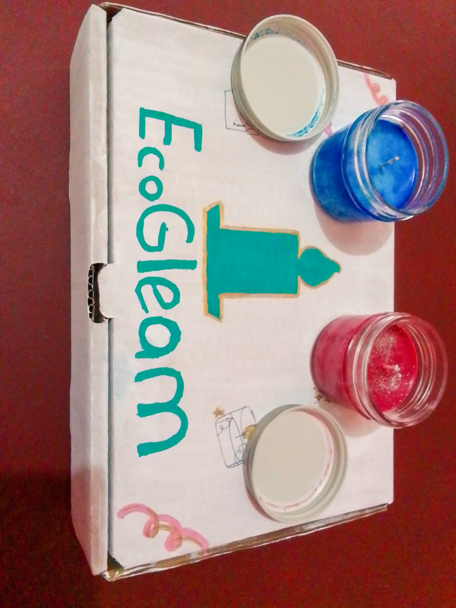
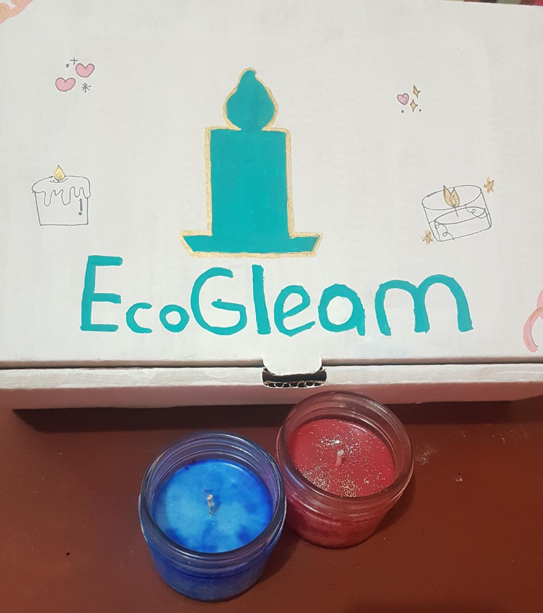
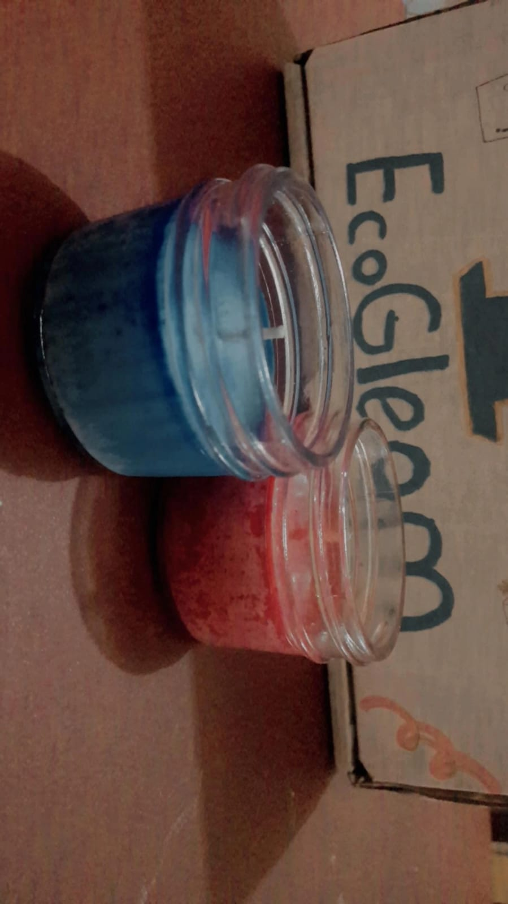



<main>
  <!-- Gallery -->
  

    

			<h1><i class="fa fa-camera-retro"></i> EcoGleam</h1>
			
 Una pequeña muestra de nuestro trabajo y compromiso... 

		

    

      

        
        <!--  -->
      

      

        
        
      

      

        
        
      

    

  

  <!-- Gallery -->
</main>
