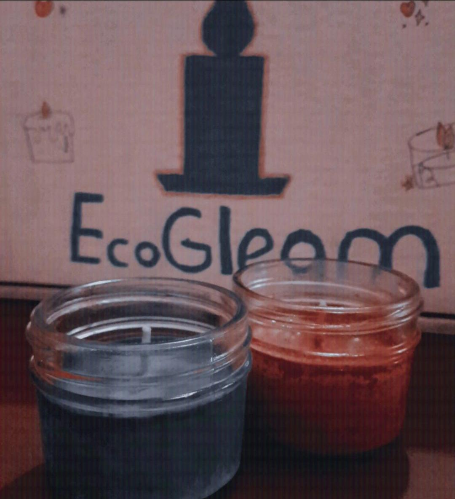



<main>
    

        

            <h1><i class="fa-duotone fa-candle-holder" style="--fa-primary-color: #468891; --fa-secondary-color: #73c4a9; --fa-secondary-opacity: 1;"></i> EcoGleam</h1>
        

    

    

        <section style="width: 50%; max-height: 450px">
            
        </section>
        <section style="width: 50%; padding: 30px;">
            <h1 class="titulo-2"> Velas Aromáticas </h1>
            

                Las velas hechas con cera de soya son una alternativa cada vez más popular y apreciada en el mercado de velas. La cera de soya se obtiene a partir del procesamiento de los granos de soya, una planta cultivada ampliamente en diversas regiones del mundo. Este tipo de velas ofrece una serie de características y ventajas que las distinguen de las velas tradicionales hechas con cera de parafina u otros materiales.
            

        </section>
    

</main>
